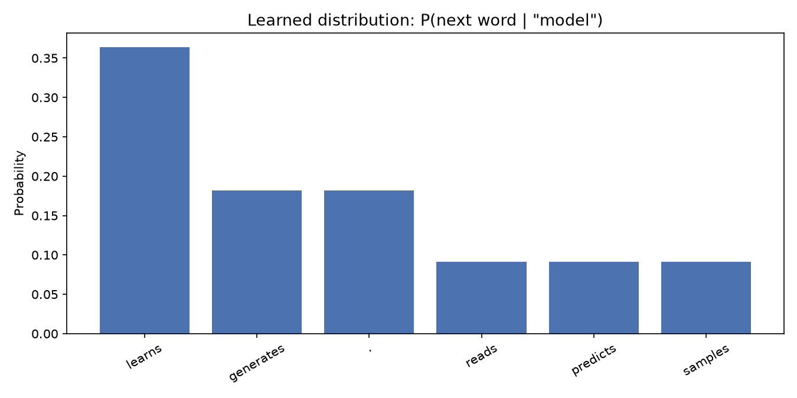

# 📘 Module 01 — The Generative AI Landscape

**Generative AI Track • Beginner**

Understand what makes a model *generative*, how it differs from a discriminative model, and how the main families of generative AI (autoregressive, diffusion, GAN, VAE) fit together.

This is the first question in almost every GenAI interview, so this module pairs the concept with a small model you build yourself.

> **In plain English:** a *discriminative* model looks at something and gives you a **label** ("this email is spam"). A *generative* model produces **new content** ("here is a reply to that email"). An LLM (the kind of model behind chat assistants) is a generative model that writes by predicting the next word, again and again. If a term is new, the [Glossary](../../GLOSSARY.md) explains it.
>
> **A note on the notation.** You will see expressions like `P(label | input)`. Read `P(...)` as **"the probability of ..."** and the vertical bar `|` as **"given"**. So `P(label | input)` means *"the probability of this label, given this input"*. `P(next word | previous words)` means *"how likely each possible next word is, given the words so far"*. That is all the math this module needs.

---

## 🎯 Objective

In this module, you'll:

- Run a **discriminative** model (DistilBERT) and a **generative** model (GPT-2) on the same input
- Build a tiny generative language model **from scratch** using bigram counts
- Visualize the probability distribution the model has learned
- Compare the four main generative model families
- Practice the interview questions this topic produces

---

## 📂 Project Files

| File | Description |
|------|-------------|
| `genai_landscape.py` | Runs the discriminative vs generative comparison, trains the bigram model, and saves the distribution plot. |
| `genai_landscape.ipynb` | Interactive notebook version of the lesson. |
| `assets/bigram_distribution.png` | The learned next-word distribution produced by the script. |
| `README.md` | Concepts and interview Q&A for this module. |

---

## ⚙️ Setup

Activate your virtual environment and install the required packages.

```powershell
# From repository root
venv\Scripts\activate

cd generative-ai\01-beginner\01-genai-landscape

pip install transformers torch matplotlib
```

---

## ▶️ Run

```powershell
python genai_landscape.py
```

The first run downloads two small models (DistilBERT and GPT-2) from Hugging Face. No API key is needed.

---

## 🧠 Key Concepts

### 1. Discriminative vs Generative

| | Discriminative | Generative |
|---|---|---|
| **Learns** | `P(label \| input)` | `P(data)` |
| **Answers** | "What is this?" | "What would this look like?" |
| **Output** | A label or score | New data (text, image, audio) |
| **Examples** | Spam filter, sentiment classifier | GPT, Stable Diffusion |

A discriminative model can only choose among the classes it was trained on. A generative model has learned the distribution of the data itself, so it can **sample** new examples from it.

(*"Distribution" here just means "which things are likely and which are rare". A model that has learned the distribution of English text knows that "the cat sat on the" is far more likely to be followed by "mat" than by "electron". **Sampling** means picking an outcome at random, weighted by those likelihoods.*)

---

### 2. Generation Is Sampling From a Learned Distribution

Every generative model, whatever its architecture, does two things:

1. **Learn** a probability distribution from training data
2. **Sample** from that distribution to produce something new

For language, this is usually written as a chain of next-token predictions:

```text
P(text) = P(token₁) × P(token₂ | token₁) × P(token₃ | token₁, token₂) × ...
```

In words: *the chance of a whole sentence is the chance of its first word, times the chance of the second word given the first, times the chance of the third given the first two, and so on.* A token is a small chunk of text, often a word or part of one.

---

### 3. A Bigram Model Is a Tiny LLM

The script builds the simplest possible language model: it counts which word follows which, then samples from those counts.



This is the same job GPT-2 does. The differences are:

| | Bigram model | LLM |
|---|---|---|
| **Context** | 1 previous word | Thousands of previous tokens |
| **How it learns** | Counting | Gradient descent on a Transformer |
| **Word meaning** | None, words are just symbols | Learned embeddings |
| **Result** | Short, incoherent sentences | Fluent, coherent text |

Look at the sample sentences it produces, such as `The output.` or `The model generates text one token at a distribution.` Each word is plausible given the one before it, but the sentence has no memory of where it started. Attention and longer context are what fix that.

---

### 4. The Four Families

| Family | Learns | Generates by | Typical output |
|---|---|---|---|
| **Autoregressive** (GPT, Claude, Llama) | Next token given previous tokens | One token at a time | Text, code |
| **Diffusion** (Stable Diffusion, DALL·E) | How to remove noise from data | Denoising over many steps | Images, video, audio |
| **GAN** | A generator/discriminator game | One forward pass | Images |
| **VAE** | A compressed latent space of the data | Decoding a sampled latent | Images, embeddings |

---

## 💻 Sample Output

```text
PART 1 — Discriminative vs Generative on the same input
Input: "The new firewall update went smoothly and everything works"

Discriminative (DistilBERT): POSITIVE (confidence 1.00)
  -> Output is a LABEL.

Generative (GPT-2): The new firewall update went smoothly and everything works. A couple of issues
have been resolved though - but not all of them, so there's only one in my test and it's a bug that
  -> Output is NEW TEXT.

PART 2 — A tiny generative model built from scratch (bigram counts)
Trained on 102 tokens, vocabulary of 42 words.

Sample 2: The model learns patterns from a large dataset.
Sample 3: The output.

P(next word | "model"):
  learns       0.36
  generates    0.18
  .            0.18
```

GPT-2 output is sampled, so your text will differ from run to run. The bigram samples are seeded and will match.

---

## 🎤 Interview Q&A

Try answering each question out loud before opening the answer.

<details>
<summary><b>Q1. What is the difference between a generative and a discriminative model?</b></summary>

**Short answer:** A discriminative model learns `P(y | x)`, the probability of a label given the input. A generative model learns the distribution of the data itself, `P(x)` or `P(x, y)`, so it can produce new samples.

**Deeper answer:** A discriminative model learns the boundary between classes and cannot create data. A generative model captures how the data is distributed, which lets it generate, and it can also classify indirectly using Bayes' rule (Naive Bayes does this). Discriminative models usually win on pure classification accuracy because they spend all their capacity on the decision boundary.

**Follow-ups to expect:**
- Can an LLM do classification? *Yes. You prompt it to output the label, or compare the probabilities it assigns to each label. It is a generative model doing a discriminative task.*
- Which is better for a spam filter? *A discriminative model, if you have labeled data and only need the label.*

</details>

<details>
<summary><b>Q2. Name the main families of generative models and what each is used for.</b></summary>

**Short answer:** Autoregressive models (text, code), diffusion models (images, video, audio), GANs (images), and VAEs (compressed representations and images).

**Deeper answer:** Text is a sequence of discrete tokens with a natural order, which suits predicting one token at a time. Images are continuous, and diffusion handles them well by learning to remove noise step by step. GANs train a generator against a discriminator. VAEs learn an encoder and decoder around a compressed latent space, and they also appear inside other systems: Stable Diffusion runs its diffusion process in a VAE's latent space.

**Follow-ups to expect:**
- Why did diffusion largely replace GANs for images? *GAN training is unstable and prone to mode collapse, where the generator covers only a few kinds of output. Diffusion trains stably and covers the data better, at the cost of slower generation because it needs many denoising steps.*

</details>

<details>
<summary><b>Q3. How does an LLM actually generate text?</b></summary>

**Short answer:** It predicts a probability distribution over the next token, samples one token from it, appends that token to the input, and repeats.

**Deeper answer:** This is the autoregressive factorization: `P(text) = ∏ P(tokenₜ | tokens before t)`. Generation stops at an end-of-sequence token or a length limit. Sampling settings such as temperature and top-p change how the next token is picked from the distribution.

**Follow-ups to expect:**
- Why do LLMs hallucinate? *They are trained to produce a plausible continuation, not to check facts. A fluent but false sentence can have high probability.*
- Why does the same prompt give different answers? *Sampling is random unless temperature is 0 (greedy decoding).* See [Week 1, Day 6](../../../weeks/week-01-llm-foundations/day-06-generation-parameters/README.md).

</details>

<details>
<summary><b>Q4. Is a bigram model a language model? How does it differ from GPT?</b></summary>

**Short answer:** Yes, it is a language model, since it assigns probabilities to the next word. GPT differs in context length, learned representations, and scale.

**Deeper answer:** A bigram model conditions on one previous word and treats words as opaque symbols, so it cannot generalize to a context it has never seen. A Transformer conditions on the whole context through attention, uses learned embeddings so similar words share statistical strength, and trains on far more data. Both are trained to predict the next token.

**Follow-ups to expect:**
- What happens to a bigram model with an unseen word pair? *The probability is zero, so you need smoothing. Neural models avoid this because embeddings let them generalize.*

</details>

<details>
<summary><b>Q5. Compare GANs, VAEs, and diffusion models.</b></summary>

**Short answer:** GANs are fast to sample but unstable to train. VAEs train stably and give a useful latent space but tend to produce blurrier output. Diffusion models give high quality and diversity but are slow to sample.

| | Training | Sampling speed | Common weakness |
|---|---|---|---|
| **GAN** | Unstable, adversarial | Fast (one pass) | Mode collapse |
| **VAE** | Stable | Fast | Blurry samples |
| **Diffusion** | Stable | Slow (many steps) | Compute cost per image |

**Follow-ups to expect:**
- How is diffusion sampling made faster? *Fewer steps with better samplers, distilled models, and running the process in a compressed latent space.*

</details>

<details>
<summary><b>Q6. What is a foundation model?</b></summary>

**Short answer:** A large model trained on broad data at scale that can be adapted to many downstream tasks.

**Deeper answer:** Instead of training one model per task, you pretrain once and then adapt through prompting, retrieval, or fine-tuning. That makes the choice between those three adaptation methods a central engineering decision, covered in a later module.

**Follow-ups to expect:**
- Are all foundation models LLMs? *No. Image, audio, and multimodal models can be foundation models too.*

</details>

---

## 🎯 Key Takeaways

After completing this module, you'll understand:

- The difference between discriminative and generative models, and how to explain it in one sentence
- Why generation means sampling from a learned probability distribution
- How a bigram model and an LLM are the same idea at different scales
- Which generative family fits which kind of data, and why
- How to answer the core interview questions on this topic

---

## 🔗 Go Deeper in the Weekly Curriculum

| Topic | Where |
|---|---|
| How tokenization and next-token prediction work | [Week 1, Day 1](../../../weeks/week-01-llm-foundations/day-01-tokenization/README.md) |
| How self-attention gives a Transformer long-range context | [Week 1, Day 2](../../../weeks/week-01-llm-foundations/day-02-transformers/README.md) |
| How sampling settings change the output | [Week 1, Day 6](../../../weeks/week-01-llm-foundations/day-06-generation-parameters/README.md) |

---

## 🚀 What's Next?

**Module 02 • Prompt Engineering**

Now that you know what a generative model is doing under the hood, the next step is steering it: zero-shot and few-shot prompting, chain-of-thought, and structured output.
