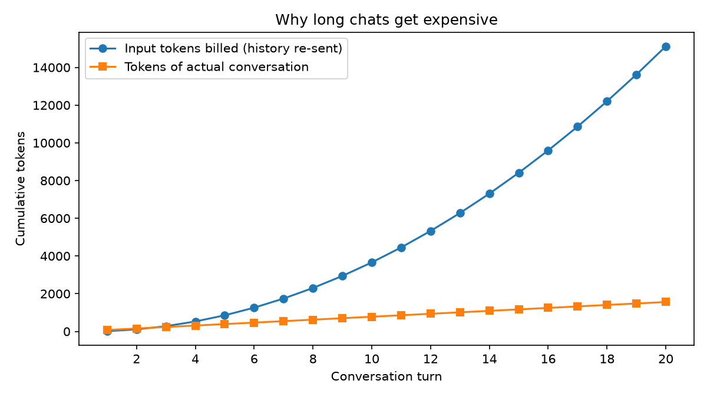

# 📘 Module 03 — LLM APIs: Tokens, Streaming, Retries, Cost

**Generative AI Track • Beginner**

In Module 02 the model ran on your own laptop. Most real products instead **call a hosted model over an API**: you send text over the internet, the provider runs the model on their GPUs, and you pay per use.

This module covers what changes when you do that: how you are **billed** (tokens), how to make replies **feel fast** (streaming), and how to survive **failures** (retries).

> **New to this?** If you have called a REST API before, this is the same idea. You send JSON, you get JSON back. The new parts are that you pay by the *token*, and that answers arrive slowly enough that you should stream them.

---

## 🎯 Objective

In this module, you'll:

- Read the structure of an LLM API request and response
- Count tokens and see why different content costs different amounts
- Estimate cost, and see why **long chats get expensive**
- Stream a reply and measure time to first token
- Write retry logic with **exponential backoff and jitter**
- Call a real hosted model, with proper error handling (needs an API key)

---

## 📂 Project Files

| File | Description |
|------|-------------|
| `llm_apis.py` | Runs every experiment. Parts 1 to 5 run offline, Part 6 calls a hosted model if an API key is set. |
| `llm_apis.ipynb` | Interactive notebook version, generated from the script. |
| `assets/history_growth.png` | Chart of how input tokens grow across a conversation. |
| `README.md` | Concepts, real results, and interview Q&A. |

---

## ⚙️ Setup

```powershell
# From repository root
venv\Scripts\activate

cd generative-ai\01-beginner\03-llm-apis

pip install "transformers>=4.56" torch matplotlib anthropic
```

**Optional, for Part 6 only:** get an API key from the [Anthropic Console](https://console.anthropic.com) and set it as an environment variable. Never paste it into code or commit it.

```powershell
$env:ANTHROPIC_API_KEY = "sk-ant-..."
```

Or put `ANTHROPIC_API_KEY=...` in a `.env` file, which this repo already gitignores. Without a key, Part 6 is skipped and everything else still runs.

---

## ▶️ Run

```powershell
python llm_apis.py
```

The local model is the same `Qwen2.5-0.5B-Instruct` from Module 02.

---

## 🧠 Key Concepts

### 1. Anatomy of an API Call

A hosted-model call is an HTTP request with JSON in and JSON out:

```python
request = {
    "model": "claude-opus-5",
    "max_tokens": 1024,
    "system": "You are a concise assistant.",
    "messages": [{"role": "user", "content": "What is a token?"}],
}
```

| Field | Meaning |
|---|---|
| `model` | Which model to run. Bigger models cost more and are slower. |
| `max_tokens` | Hard cap on reply length. Hit it and the reply is cut off. |
| `messages` | The whole conversation. The API is **stateless**, it remembers nothing between calls. |
| `usage` (response) | Tokens billed. This is how you track cost. |
| `stop_reason` (response) | Why it stopped. `end_turn` is normal, `max_tokens` means truncated. |

---

### 2. Tokens

Models read **tokens**, not letters or words, and providers bill by them. We tokenized five kinds of text:

| Text | Characters | Tokens | Characters per token |
|---|---|---|---|
| English sentence | 44 | 10 | 4.4 |
| Python code | 49 | 20 | 2.5 |
| Numbers | 27 | 27 | 1.0 |
| Hindi | 27 | 27 | 1.0 |
| Emoji | 13 | 7 | 1.9 |

English is cheap. Code, numbers, and non-English text cost more for the same length. If your users write in Hindi, your bill per message is noticeably higher than the same app in English.

These counts come from the Qwen tokenizer. **Every model family has its own tokenizer**, so they are only estimates for another provider. For exact numbers use the provider's own counter, such as the Claude `count_tokens` endpoint.

---

### 3. Cost

```text
cost = input_tokens × input_price + output_tokens × output_price
```

Prices are quoted per **million** tokens, and output costs more than input. For a support bot handling 10,000 requests a day with 800 tokens in and 200 out (prices from Anthropic's June 2026 list, which will change):

| Model | Per request | Per month |
|---|---|---|
| claude-opus-5 | $0.00900 | $2,700 |
| claude-sonnet-5 | $0.00360 | $1,080 |
| claude-haiku-4-5 | $0.00180 | $540 |

Picking a model is a cost decision as much as a quality one. The right choice is the cheapest model that passes your tests, which is why Module 06 is about evaluation.

---

### 4. The Hidden Cost: History Is Re-Sent Every Turn

Because the API is stateless, a chatbot sends the **entire conversation** on every turn.



In our simulation each turn adds about 78 new tokens. After 20 turns, the app has been billed for **15,120 input tokens**, which is **9.7x** the 1,560 tokens of actual conversation. Cost grows much faster than the number of turns.

Ways to control it: trim old messages, summarize older turns, and use **prompt caching**, which discounts the repeated part of the input (Module 11).

---

### 5. Streaming

Without streaming, the user sees nothing until the whole reply is ready. With streaming, tokens arrive as they are generated.

| | Measured (local model, CPU) |
|---|---|
| Time to first token | **0.13 s** |
| Total time | **6.21 s** |

The total is the same either way. What changes is that the user sees text after a fraction of a second instead of after six. For chat interfaces this is the difference between feeling instant and feeling broken.

---

### 6. Retries

| Failure | Retry? |
|---|---|
| `429` rate limit | ✅ Yes, after waiting |
| `5xx` server error, overloaded | ✅ Yes |
| Timeout, connection error | ✅ Yes |
| `400` bad request | ❌ Fix the request |
| `401` / `403` | ❌ Bad key or permissions |
| `404` | ❌ Wrong model name or URL |

Retry with **exponential backoff** (wait 1s, 2s, 4s, ...) and **jitter** (randomize the wait), so many clients that failed together don't all retry at the same instant:

```python
delay = min(base_delay * 2**attempt, max_delay)
delay = random.uniform(0, delay)   # "full jitter"
```

The official SDKs already retry connection errors, 408, 409, 429, and 5xx twice by default. Write your own only when you need something beyond that.

---

### 7. Calling a Real Model

```python
import anthropic

client = anthropic.Anthropic()   # reads ANTHROPIC_API_KEY from the environment

response = client.messages.create(
    model="claude-opus-5",
    max_tokens=1024,
    messages=[{"role": "user", "content": "What is a token?"}],
)
print(response.usage.input_tokens, response.usage.output_tokens)
```

The script's version adds a chain of `except` blocks, most specific first (`RateLimitError`, `AuthenticationError`, `BadRequestError`, `APIConnectionError`, `APIStatusError`), because a rate limit and a bad request need different handling. It also checks `stop_reason` for a refusal or truncation before reading the text.

> **Testing note:** the hosted-model code in Part 6 was verified against a local mock of the Messages API (correct endpoints, headers, request body, streaming and token-count parsing), not against the live service, because no API key was available while writing it. Run it with your own key before relying on it.

---

## 🎤 Interview Q&A

Try answering each question out loud before opening the answer.

<details>
<summary><b>Q1. What is a token, and why does it matter to an application developer?</b></summary>

**Short answer:** A token is the chunk of text a model reads and writes, often a word or part of a word. It matters because cost, latency, and the context limit are all measured in tokens.

**Deeper answer:** A rough rule for English is about 4 characters or 0.75 words per token, but it varies. Code, numbers, and non-English languages usually take more tokens for the same length, so they cost more and fill the context window faster. Each model family has its own tokenizer, so counts are not portable between providers.

**Follow-ups to expect:**
- How would you get an exact token count? *Use the provider's counting endpoint or tokenizer for that specific model, not a different vendor's tokenizer.*
- Why might a Hindi chatbot cost more than an English one? *More tokens per message for the same meaning.*

</details>

<details>
<summary><b>Q2. Why does a chatbot get more expensive as the conversation gets longer?</b></summary>

**Short answer:** LLM APIs are stateless, so every turn re-sends the whole conversation. Input tokens grow each turn, and total cost grows much faster than the number of turns.

**Deeper answer:** If each turn adds `n` tokens, the input on turn `k` is roughly `k × n`, so the total over `T` turns grows like `T²`. Mitigations: trim the oldest messages, summarize older turns into a short note, retrieve only relevant history, and use prompt caching so the repeated prefix is billed at a discount.

**Follow-ups to expect:**
- What is the downside of trimming history? *The model forgets earlier details, so you must decide what is safe to drop.*

</details>

<details>
<summary><b>Q3. How would you estimate and reduce the cost of an LLM feature?</b></summary>

**Short answer:** Measure average input and output tokens per request, multiply by the model's prices and your expected volume, then reduce tokens, cache repeated context, and use the cheapest model that passes your tests.

**Deeper answer:** Log `usage` from every response so estimates come from real data. Levers, roughly in order of ease: shorten prompts and history, cap `max_tokens`, cache stable prefixes, batch non-urgent work through a discounted batch API, and route simple requests to a smaller model. Remember output tokens cost more than input tokens, and that reasoning or thinking tokens on some models are billed as output.

**Follow-ups to expect:**
- How do you know a cheaper model is good enough? *Run both on an evaluation set and compare quality, covered in Module 06.*

</details>

<details>
<summary><b>Q4. Why stream responses, and what does it change?</b></summary>

**Short answer:** Streaming sends tokens as they are generated, so users see text almost immediately. Total generation time is the same, but time to first token drops from seconds to a fraction of a second.

**Deeper answer:** Generation is sequential, so a long answer takes seconds to finish. Streaming (usually server-sent events) improves perceived latency and lets users start reading or cancel early. It also avoids request timeouts on long outputs. The cost is more complex client code, and you must validate the assembled result before acting on it, since a partial stream is not a complete answer.

**Follow-ups to expect:**
- What metric would you track? *Time to first token and tokens per second, alongside total time.*

</details>

<details>
<summary><b>Q5. How do you handle rate limits and transient failures?</b></summary>

**Short answer:** Retry only retryable errors (429, 5xx, timeouts, connection errors) with exponential backoff and jitter, cap the attempts, and never retry 4xx errors like 400 or 401.

**Deeper answer:** Respect the `retry-after` header when the provider sends one. Jitter prevents a thundering herd of clients retrying together. Also consider a request timeout, a client-side rate limiter or queue to stay under quota, idempotency so a retried call cannot cause a duplicate side effect, and a fallback such as a second model when one is overloaded. Official SDKs already implement sensible retry defaults.

**Follow-ups to expect:**
- What is the difference between a 429 and a 529 or 503? *A 429 means you exceeded your limit and should slow down. 5xx or overloaded means the provider is struggling, and retrying with backoff is still right.*

</details>

<details>
<summary><b>Q6. When would you use a hosted API instead of a self-hosted open model?</b></summary>

**Short answer:** Hosted APIs are best for top quality, fast start, and low ops burden. Self-hosting is best for data that must not leave your infrastructure, very high steady volume, or deep customization.

| | Hosted API | Self-hosted open model |
|---|---|---|
| **Quality ceiling** | Highest | Good, and improving |
| **Setup effort** | Minutes | GPUs, serving stack, upgrades |
| **Cost shape** | Pay per token | Fixed hardware cost |
| **Data privacy** | Data goes to a provider | Stays in your environment |
| **Customization** | Prompting, some fine-tuning | Full control, any fine-tuning |

**Follow-ups to expect:**
- At what point does self-hosting become cheaper? *When steady, high volume keeps the GPUs busy enough that fixed cost beats per-token pricing, which needs a real calculation with your traffic.*

</details>

---

## 🎯 Key Takeaways

After completing this module, you'll understand:

- How an LLM API request and response are structured
- Why billing is per token and how to estimate cost
- Why long conversations get expensive and how to control it
- Why streaming improves how fast an app feels
- Which failures to retry, and how to back off safely
- How to trade off hosted APIs against self-hosted models

---

## 🔗 Go Deeper in the Weekly Curriculum

| Topic | Where |
|---|---|
| Context windows and token limits | [Week 1, Day 5](../../../weeks/week-01-llm-foundations/day-05-context-window/README.md) |
| Running open models locally | [Week 1, Day 4](../../../weeks/week-01-llm-foundations/day-04-open-models/README.md) |
| Quantization to shrink self-hosted models | [Week 3, Day 1](../../../weeks/week-03-efficient-fine-tuning/day-01-quantization-basics/README.md) |

---

## 🚀 What's Next?

**Module 04 • Embeddings & Vector Search**

Next you'll learn how to turn text into numbers so a program can search by *meaning* instead of keywords, the foundation for retrieval-augmented generation.
