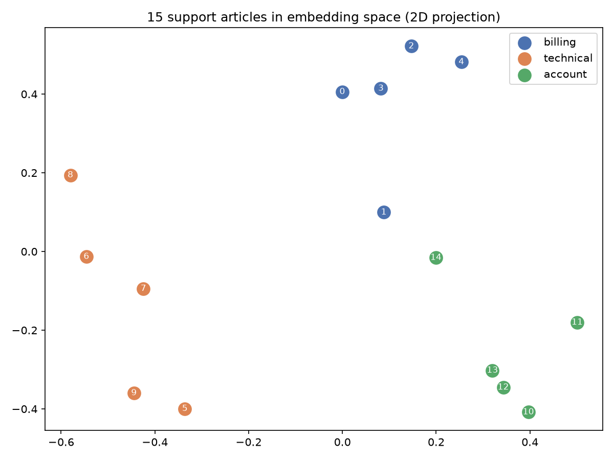

# 📘 Module 04 — Embeddings & Vector Search

**Generative AI Track • Beginner**

How can you search for *"my card got hit two times for the same month"* and find an article about *duplicate payment refunds*, when the two share almost no words?

You turn text into **numbers that capture meaning**. These numbers are called **embeddings**, and they power semantic search, recommendations, duplicate detection, and retrieval-augmented generation (RAG), which is the next big topic in this track.

> **New to this?** Think of an embedding as GPS coordinates for meaning. Two sentences about the same thing get coordinates that are close together, even if they use different words.

---

## 🎯 Objective

In this module, you'll:

- Turn sentences into vectors and compare them with **cosine similarity**
- Build semantic search **from scratch** in a few lines of NumPy
- Compare keyword search against semantic search on the same queries
- Measure how brute-force search scales, and see why vector databases exist
- Use a vector database (Chroma) with metadata filters
- Learn what embeddings are **bad** at

---

## 📂 Project Files

| File | Description |
|------|-------------|
| `embeddings_vector_search.py` | Runs every experiment in this module. |
| `embeddings_vector_search.ipynb` | Interactive notebook version, generated from the script. |
| `assets/embedding_map.png` | 2D map of the 15 support articles in embedding space. |
| `README.md` | Concepts, real results, and interview Q&A. |

---

## ⚙️ Setup

```powershell
# From repository root
venv\Scripts\activate

cd generative-ai\01-beginner\04-embeddings-vector-search

pip install "transformers>=4.56" torch scikit-learn matplotlib chromadb
```

---

## ▶️ Run

```powershell
python embeddings_vector_search.py
```

The first run downloads `all-MiniLM-L6-v2` (about 90 MB). You may see a model load report mentioning `embeddings.position_ids`. It is harmless.

The script computes embeddings directly with `transformers` (run the model, average the token vectors, normalize) instead of calling the `sentence-transformers` library. The result is identical for this model, it needs fewer dependencies, and it shows what the library does internally.

---

## 🧠 Key Concepts

### 1. What Is an Embedding?

An embedding model reads text and outputs a **vector**: a list of numbers. This model outputs 384 of them.

```text
"How do I reset my password?"  ->  [ 0.007, -0.063, -0.072, -0.032, -0.043, 0.070, ... ]
```

The individual numbers mean nothing alone. What matters is the **distance between vectors**.

---

### 2. Cosine Similarity

Cosine similarity is the cosine of the angle between two vectors. `1.0` means the same direction (similar meaning), `0` means unrelated.

```python
def cosine_similarity(a, b):
    return float(np.dot(a, b) / (np.linalg.norm(a) * np.linalg.norm(b)))
```

When vectors are normalized to length 1, this is just a **dot product**, which is why search is fast.

| Sentence pair | Similarity |
|---|---|
| "How do I reset my password?" vs "I forgot my login credentials" | **0.68** |
| "How do I reset my password?" vs "What is the best pizza topping?" | **0.09** |

---

### 3. Keyword Search vs Semantic Search

We tested a 15-article knowledge base with 10 **paraphrased** questions that share few words with the right answer.

| Query | Keyword | Semantic |
|---|---|---|
| my card got hit two times for the same month | ❌ | ✅ |
| I forgot my login credentials | ✅ | ✅ |
| the page takes forever to load charts | ❌ | ✅ |
| how do I get my money back | ❌ | ✅ |
| app keeps closing as soon as I open it | ❌ | ✅ |
| too many requests error from your API | ✅ | ✅ |
| I want to leave and remove all my data | ❌ | ✅ |
| add my colleague to the workspace | ✅ | ✅ |
| spreadsheet download comes out empty for huge reports | ❌ | ✅ |
| can I pay by wire | ❌ | ✅ |
| **Top-1 accuracy** | **3 / 10** | **10 / 10** |

Semantic search matches meaning, so it survives paraphrasing. Don't over-trust the 10 out of 10: this is a tiny, clean collection where every topic is distinct. With thousands of similar articles it gets harder, and Module 06 shows how to measure that.

**How confident is each match?** The best score for real questions ranged from 0.30 to 0.69. Some wins were narrow: "can I pay by wire" scored 0.30 against a runner-up of 0.27.

---

### 4. Search Always Returns Something

We asked two questions the knowledge base cannot answer:

| Question | Best match score |
|---|---|
| "how do I bake a chocolate cake" | 0.06 |
| "who won the football match yesterday" | 0.07 |

Both still returned a top result. But the scores sit far below the 0.30 minimum of the real questions, so a **similarity threshold** (for example, 0.2) lets an app say *"I couldn't find an answer"* instead of showing an unrelated article. Pick the threshold by testing on your own data.

---

### 5. A Picture of Meaning

PCA squashes the 384 dimensions down to 2. Colored by category, the articles form three groups.



Article 1 ("charged twice for the same subscription") sits between billing and account, which makes sense: it is about money but also about your subscription.

---

### 6. Scaling: Brute Force vs Vector Databases

Our search compares the query with **every** document. Measured with random 384-dimension vectors:

| Documents | Search time | Memory |
|---|---|---|
| 1,000 | 0.1 ms | 2 MB |
| 10,000 | 0.6 ms | 15 MB |
| 100,000 | 8.1 ms | 154 MB |
| 500,000 | 47.1 ms | 768 MB |

Time and memory grow **linearly**. Brute force is still quick at half a million vectors on this laptop, so for small and medium collections it is a good choice. At ten times that size you would need roughly 7.7 GB and ten times the search time (an extrapolation, not a measurement).

Vector databases are built for that scale, and for what brute force lacks:

- **Approximate nearest neighbor (ANN)** indexes such as HNSW, which skip most comparisons in exchange for a little accuracy
- Durable storage, updates, and deletes
- **Metadata filtering**

With Chroma, the same query returns different results with and without a filter:

| Query: "I was billed twice" | Top result |
|---|---|
| No filter | *"If you were charged twice for the same subscription..."* (distance 0.29) |
| Only `category = technical` | *"Webhooks that fail three times in a row..."* (distance 0.74) |

Chroma reports **distance**, where lower is closer and cosine distance = `1 - cosine similarity`. Filters let you restrict a search by category, customer, date, or user permissions.

---

### 7. What Embeddings Are Bad At

Embeddings capture **topical similarity**, not logic or truth.

| Case | Similarity | Sentences |
|---|---|---|
| Negation | **0.92** | "The refund was approved." vs "The refund was **not** approved." |
| Opposites | **0.83** | "The server is up." vs "The server is down." |
| Different numbers | **0.93** | "The plan costs $10 per month." vs "$1000 per month." |
| Word sense | 0.40 | "deposited money at the **bank**" vs "picnic on the river **bank**" |
| Truly unrelated | -0.04 | "The refund was approved." vs "Penguins live in Antarctica." |

Sentences that mean the **opposite** score almost as high as paraphrases, because they are about the same topic. Similarity is a good way to **find candidates** and a poor way to decide what is **true**. Real systems retrieve with embeddings, then let a stronger step (a reranker or the LLM) judge relevance.

---

## 🎤 Interview Q&A

Try answering each question out loud before opening the answer.

<details>
<summary><b>Q1. What is an embedding, and what is it used for?</b></summary>

**Short answer:** An embedding is a vector of numbers that represents the meaning of a piece of text (or an image, audio clip, and so on), so that similar items are close together in vector space.

**Deeper answer:** An embedding model is trained so that semantically similar inputs produce nearby vectors. Uses include semantic search, RAG retrieval, recommendations, clustering, duplicate detection, and classification with a simple model on top of the vectors.

**Follow-ups to expect:**
- Are the individual dimensions interpretable? *No. Only the relationships between vectors carry meaning.*
- Are LLM embeddings and embedding-model embeddings the same thing? *Related but different. Dedicated embedding models are trained specifically so that whole-text similarity works well.*

</details>

<details>
<summary><b>Q2. Cosine similarity, dot product, and Euclidean distance: what is the difference, and why normalize?</b></summary>

**Short answer:** Cosine similarity compares the **direction** of two vectors and ignores their length. The dot product also depends on length. Euclidean distance measures straight-line distance. For unit-length vectors, cosine similarity equals the dot product, and all three give the same ranking.

**Deeper answer:** Normalizing vectors to length 1 means you can use a fast dot product and still get cosine similarity. It also stops long or repetitive text from getting a high score just because its vector is larger. Check which metric your embedding model was trained for, and use the same one in the vector database.

**Follow-ups to expect:**
- What does a cosine similarity of 0 mean? *The vectors are orthogonal, so unrelated in the model's view.*

</details>

<details>
<summary><b>Q3. When is semantic search better than keyword search, and when is it worse?</b></summary>

**Short answer:** Semantic search is better when users paraphrase and the exact words differ. Keyword search is better for exact terms such as error codes, product IDs, names, and rare jargon. Production systems often combine both (**hybrid search**).

**Deeper answer:** In our test, keyword search got 3 of 10 paraphrased queries and semantic search got 10 of 10. But an embedding model may blur rare identifiers such as `ERR_4021` into general text, where keyword search finds them exactly. Hybrid search runs both and merges the rankings, for example with reciprocal rank fusion, and often adds a reranker on top.

**Follow-ups to expect:**
- How would you decide between them? *Test both on real queries from your users and measure recall.*

</details>

<details>
<summary><b>Q4. How do vector databases search millions of vectors quickly?</b></summary>

**Short answer:** They use approximate nearest neighbor (ANN) indexes such as HNSW or IVF, which examine only a small part of the data and return the *nearly* best matches.

**Deeper answer:** Exact search compares the query with every vector, so time grows linearly. HNSW builds a layered graph so a search hops toward the query in a handful of steps. IVF clusters the vectors and searches only the closest clusters. Both trade a little **recall** (the chance of returning the true best matches) for large speedups, and you tune that trade-off. Vector databases also handle persistence, updates, and metadata filtering.

**Follow-ups to expect:**
- When is brute force fine? *For small and medium collections. We measured about 47 ms at 500,000 vectors, so many applications never need an ANN index.*
- Why is filtering hard for ANN indexes? *A filter can remove most of the graph's neighbors, so databases need special handling to keep results good and fast.*

</details>

<details>
<summary><b>Q5. What are the limitations of embedding-based retrieval?</b></summary>

**Short answer:** Embeddings capture topic, not logic. They confuse negation and opposites, are weak on exact identifiers and numbers, depend on the model's training domain, and always return a result even when nothing is relevant.

**Deeper answer:** We measured "approved" vs "not approved" at 0.92 similarity and "$10" vs "$1000" at 0.93. Mitigations: hybrid search for exact terms, a reranker or the LLM to judge relevance, a similarity threshold to reject off-topic queries, and good chunking so each vector covers one idea. Domain-specific text such as legal or medical may need a specialized or fine-tuned embedding model.

**Follow-ups to expect:**
- How would you stop the system returning irrelevant results? *A tuned similarity threshold, plus letting the model answer "not found" when the retrieved text does not contain the answer.*

</details>

<details>
<summary><b>Q6. How would you choose and evaluate an embedding model?</b></summary>

**Short answer:** Shortlist models by language support, size, speed, and cost, then evaluate them on your own data with a labeled set of queries and measure recall@k.

**Deeper answer:** Public leaderboards such as MTEB give a starting point but may not match your domain. Consider embedding dimension (larger means more storage and slower search), maximum input length, multilingual needs, and whether you can host it or must call an API. Build 50 to 100 real queries with known correct documents, then compare models on recall@k and MRR. Remember that changing the model means re-embedding your whole collection, since vectors from different models are not comparable.

**Follow-ups to expect:**
- What if a document is longer than the model's input limit? *Split it into chunks and embed each one, the subject of Module 05.*

</details>

---

## 🎯 Key Takeaways

After completing this module, you'll understand:

- What an embedding is and how cosine similarity measures meaning
- How to build semantic search from scratch in a few lines
- Why semantic search beats keyword search on paraphrased queries, and where it doesn't
- How brute-force search scales, and what vector databases add
- How metadata filters and similarity thresholds make retrieval practical
- Why embeddings find related text but cannot judge truth

---

## 🔗 Go Deeper in the Weekly Curriculum

| Topic | Where |
|---|---|
| Token embeddings inside a Transformer | [Week 1, Day 2](../../../weeks/week-01-llm-foundations/day-02-transformers/README.md) |
| Advanced RAG and vector databases | Week 6 — RAG *(planned)* |

---

## 🚀 What's Next?

**Beginner Project • Support Ticket Assistant**

Time to combine everything from Modules 02 to 04 into one working tool: classify tickets with a prompt, validate the result, and find similar past tickets with semantic search.
