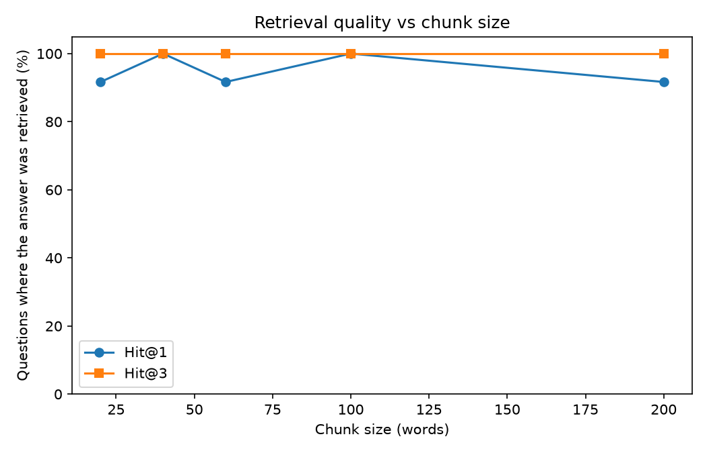

# 📘 Module 05 — Retrieval-Augmented Generation (RAG)

**Generative AI Track • Intermediate**

A language model only knows what was in its training data. It has never seen **your** company's handbook, yesterday's support tickets, or a document you wrote this morning. Ask it anyway and it will confidently make something up.

**RAG** (Retrieval-Augmented Generation) fixes this. Instead of hoping the model remembers, you **look up** the relevant text and **paste it into the prompt**, so the model answers from evidence. It is the most common pattern in production GenAI, and the most common intermediate interview topic.

> **Where this fits:** you already have every piece. Module 04 gave you retrieval, Module 02 gave you prompting, and the Support Ticket Assistant project used both. This module puts them together properly and, more importantly, teaches you how to tell **why** a RAG system fails.

---

## 🎯 Objective

In this module, you'll:

- Build a complete RAG pipeline: chunk, embed, retrieve, augment, generate, cite
- Measure the **no-retrieval baseline** so you know exactly what RAG adds
- Compare **chunk sizes** and see the trade-off
- Separate **retrieval failures** from **generation failures**
- Handle questions the documents **cannot** answer

---

## 📂 Project Files

| File | Description |
|------|-------------|
| `rag.py` | The full pipeline and every experiment. |
| `rag.ipynb` | Interactive notebook version, generated from the script. |
| `assets/chunk_size.png` | Retrieval quality across chunk sizes. |
| `README.md` | Concepts, real results, and interview Q&A. |

---

## ⚙️ Setup

```powershell
# From repository root
venv\Scripts\activate

cd generative-ai\02-intermediate\05-rag

pip install "transformers>=4.56" torch matplotlib
```

## ▶️ Run

```powershell
python rag.py
```

Uses the two small models from earlier modules (`all-MiniLM-L6-v2` for embeddings, `Qwen2.5-0.5B-Instruct` for answers). No API key needed. It takes a few minutes on a laptop CPU.

---

## 🧠 Key Concepts

### 1. The Pipeline

```text
                    ┌─────────────────────────────  done once  ─────────────┐
 Documents  ──►  Chunk  ──►  Embed  ──►  Store in an index
                                                    │
                    ┌────────────────  done per question  ──────────────────┼──┐
 Question  ──►  Embed  ──►  Retrieve top-k chunks ◄─┘                       │  │
                                     │                                       │  │
                                     ▼                                       │  │
                     Prompt = instructions + numbered sources + question     │  │
                                     │                                       │  │
                                     ▼                                       │  │
                              LLM answers, citing [1], [2]  ─────────────────┘  │
                                                                                 
```

1. **Retrieve** the chunks most relevant to the question
2. **Augment** the prompt with them as numbered sources
3. **Generate** an answer that cites its sources

### 2. The Test Bed

A made-up company handbook (six short documents, 500 words) with facts like *"expenses over $75 need manager approval"*. Because every fact is invented, the model cannot know them from training, so a correct answer **proves** retrieval worked. Twelve questions have answers in the handbook, and two do not.

---

### 3. Without Retrieval, the Model Guesses

| | Correct |
|---|---|
| No retrieval | **1 / 12** |

And the wrong answers sound sure of themselves. Asked for the new-employee vacation allowance, it said *"typically 10 vacation days, unless they have been with the company for more than five years"* (the handbook says 20). Asked who the CEO is, it named *"John Smith, the company's founder"*. Nothing in the documents says that.

---

### 4. Chunking

You can't paste whole documents into every prompt, so you split them into **chunks**. Size is a trade-off:

- **Too small:** a fact gets cut in half or loses its context
- **Too big:** a chunk covers many topics, matches weakly, and pads the prompt with noise

We split by words, with overlap so a fact near a boundary stays whole in at least one chunk.

| Chunk size | Chunks | Hit@1 | Hit@3 | Words pasted into the prompt (k=3) |
|---|---|---|---|---|
| 20 words | 34 | 92% | 100% | 58 |
| 40 words | 19 | 100% | 100% | 107 |
| 60 words | 13 | 92% | 100% | 137 |
| 100 words | 7 | 100% | 100% | 231 |
| 200 words | 6 | 92% | 100% | 256 |

*Hit rate = the share of questions where the right fact appears in the retrieved chunks.*

**Read this honestly:** on a corpus this small, every size finds the answer almost every time, so hit rate barely separates them. The cost shows up in the last column: bigger chunks paste 4x more text into every prompt (more tokens, per Module 03) and give the model more to get lost in. On a large corpus with many similar documents, oversized chunks also match more weakly. The rule of thumb: **use the smallest chunks that keep each fact intact.**



---

### 5. Augment and Generate

The model sees numbered sources and a strict instruction:

```text
Sources:
[1] (expenses.md) Expenses under $75 do not need pre-approval. Anything over $75 needs written approval...
[2] (expenses.md) $60 per day. Hotels are reimbursed up to $180 per night...
[3] (benefits.md) $30 per month. Stock options vest over 4 years...

Question: Above what amount do I need my manager's approval to spend money?
```

Answer: `$75`, and the app can show that it came from `expenses.md`.

---

### 6. Did RAG Help?

| | Correct | Refused to answer |
|---|---|---|
| No retrieval | 1 / 12 | n/a |
| RAG, prompt v1 (obvious) | 5 / 12 | 3 |
| RAG, prompt v2 (with an example) | **8 / 12** | 4 |

RAG lifted correct answers from 1 to 8 of 12. But the more useful lesson is in what went wrong.

**When RAG fails, there are exactly two possible causes, and you must know which one you have:**

| | Retrieval failure | Generation failure |
|---|---|---|
| **What happened** | The right chunk was never retrieved | The right chunk was in the prompt but the answer was still bad |
| **How to check** | Is the fact in the retrieved text? | Retrieval found it, yet the answer is wrong |
| **Fix** | Chunking, embeddings, `k`, reranking | Prompt, stronger model |

In this experiment, retrieval found the fact for **every** question, so every failure was a **generation** failure. Prompt v1 said *"cite like [1]"*, and the small model often answered with only `[1]`. Prompt v2 described the shape of a good answer and gave one example (`Employees get 30 days of leave. [2]`), which removed those citation-only answers.

It did **not** fix everything: the model still refused 4 questions whose answer was in its prompt.

---

### 7. When the Answer Isn't in the Documents

| Question | No retrieval | RAG |
|---|---|---|
| Company policy on pets? | Invents a "no pets" policy | "I don't know." ✅ |
| Who is the CEO? | "John Smith, the founder" | "I don't know." ✅ |

Giving the model permission to say "I don't know" stopped the invention. But the same instruction made it refuse 4 answerable questions. Every escape hatch trades one error for another:

| | Without the escape hatch | With the escape hatch |
|---|---|---|
| **Answer exists** | Usually answered | Sometimes wrongly refused |
| **Answer missing** | Invents an answer | Correctly declines |

You choose the balance by measuring **both** on your own questions. Larger models handle this far better, which is one reason RAG quality depends so much on the generator.

---

## 🎤 Interview Q&A

Try answering each question out loud before opening the answer.

<details>
<summary><b>Q1. What is RAG, and why use it instead of fine-tuning?</b></summary>

**Short answer:** RAG retrieves relevant documents at question time and puts them in the prompt, so the model answers from that evidence. It is usually the right choice for giving a model knowledge it doesn't have.

**Deeper answer:** Fine-tuning changes model *behavior and style*, but it is a poor and expensive way to add *facts*: it needs training, the knowledge goes stale, you can't show where an answer came from, and you can't delete a fact or apply per-user permissions. RAG updates instantly when documents change, can cite sources, and can enforce access control at retrieval time. Fine-tuning is better for tone, format, or a specialized skill. The two can be combined.

**Follow-ups to expect:**
- When would you fine-tune instead? *When you need consistent behavior, style, or output format that prompting can't hold, not to store facts.*
- Can RAG still hallucinate? *Yes. The model can ignore or misread the context, so you still measure and add guardrails.*

</details>

<details>
<summary><b>Q2. Walk me through a RAG pipeline, and tell me how you would debug a wrong answer.</b></summary>

**Short answer:** Offline: chunk documents, embed them, store them in an index. Online: embed the question, retrieve the top-k chunks, build a prompt with those chunks, generate, and cite. To debug a wrong answer, first check whether the right chunk was retrieved.

**Deeper answer:** A wrong answer has two possible causes. If the correct chunk is *not* in the retrieved set, it is a **retrieval failure**: look at chunking, the embedding model, `k`, hybrid search, or reranking. If the correct chunk *is* in the prompt but the answer is still wrong, it is a **generation failure**: look at the prompt, the amount of context, or the model. Evaluating retrieval and generation **separately** is what makes RAG debuggable. In our experiment, retrieval succeeded on all 12 questions, so every failure was in generation.

**Follow-ups to expect:**
- What metric measures retrieval? *Hit rate or recall@k, and MRR. Module 06 builds these.*

</details>

<details>
<summary><b>Q3. How do you choose chunk size and overlap?</b></summary>

**Short answer:** Use the smallest chunks that keep each fact and its context intact, with some overlap, then tune by measuring retrieval quality on real questions.

**Deeper answer:** Small chunks match precisely and keep prompts short, but can split a fact or lose the context that makes it meaningful. Large chunks preserve context but match more weakly and pad every prompt with irrelevant text, raising cost and dilution. Overlap protects facts near a boundary. Better than fixed word counts is chunking along the document's own structure (headings, paragraphs, sections), often keeping the heading with each chunk. In our test, a 200-word chunk pasted about 4x more text into the prompt than a 40-word chunk for a similar hit rate.

**Follow-ups to expect:**
- What is "small to big" retrieval? *Match on small chunks for precision, then return the larger parent section for context.*

</details>

<details>
<summary><b>Q4. How do you reduce hallucination in a RAG system?</b></summary>

**Short answer:** Retrieve well, instruct the model to answer only from the sources and to say when it doesn't know, require citations, and measure the result.

**Deeper answer:** Layers: better retrieval so the right evidence is present; a prompt that restricts the answer to the sources; citations so claims can be checked; a similarity threshold to skip generation when nothing relevant was found; and checks that the answer is supported by the retrieved text. Be aware of the trade-off we measured: the "say you don't know" instruction stopped invented answers (a made-up CEO) but also made a small model refuse 4 of 12 answerable questions. Measure both wrong answers *and* wrongful refusals.

**Follow-ups to expect:**
- How do you know an answer is grounded? *Check that its claims are supported by the retrieved chunks, using an LLM judge or a natural-language-inference model (Module 06).*

</details>

<details>
<summary><b>Q5. Retrieval is missing relevant chunks. How do you improve it?</b></summary>

**Short answer:** Try hybrid search, reranking, better chunking, a stronger embedding model, query rewriting, metadata filters, and a larger `k`.

**Deeper answer:** **Hybrid search** combines keyword and semantic scores, which fixes exact terms like IDs. A **reranker** (a cross-encoder) rescores the top 20 to 50 candidates and keeps the best few, which is more accurate than embeddings alone but slower. **Query rewriting** turns a vague or conversational question into a clean search query, and HyDE embeds a hypothetical answer instead. **Metadata filters** narrow by document type, date, or permissions. Improving the embedding model may require re-embedding everything. Always confirm each change with a retrieval metric rather than a feeling.

**Follow-ups to expect:**
- What is the cost of a larger `k`? *More tokens per prompt and more noise for the model, so recall goes up while answer quality can go down.*

</details>

<details>
<summary><b>Q6. Why not just paste all the documents into a long context window?</b></summary>

**Short answer:** Sometimes you can, but RAG scales better, costs less per question, and gives you control over freshness and permissions.

**Deeper answer:** Long context works for small collections. But you pay for every input token on every question, latency grows with prompt size, and models can miss facts buried in the middle of very long inputs. A large knowledge base may not fit at all. RAG sends only the relevant few chunks, updates by re-indexing changed documents, and can filter what each user is allowed to see before the model ever reads it. A common hybrid: retrieve broadly, then place the best chunks into a generous context.

**Follow-ups to expect:**
- How do you handle document updates? *Re-chunk and re-embed only the changed documents, and delete the old chunks.*
- How do you handle per-user permissions? *Filter by access metadata at retrieval time so restricted text never reaches the prompt.*

</details>

---

## 🎯 Key Takeaways

After completing this module, you'll understand:

- The RAG pipeline: retrieve, augment, generate, and cite
- Why a no-retrieval baseline matters, and how confidently a model can be wrong
- The chunk-size trade-off, and why prompt cost is part of it
- How to tell a **retrieval** failure from a **generation** failure
- That "I don't know" is a trade-off between hallucination and over-refusal
- How RAG compares with fine-tuning and long context

---

## 🔗 Go Deeper in the Weekly Curriculum

| Topic | Where |
|---|---|
| Embeddings and vector search | [Module 04](../../01-beginner/04-embeddings-vector-search/README.md) |
| Fine-tuning as the alternative | [Week 2](../../../weeks/week-02-fine-tuning-fundamentals/README.md) |
| Advanced RAG: HyDE, Self-RAG, CRAG, RAGAS | Week 6 — RAG *(planned)* |

---

## 🚀 What's Next?

**Module 06 • Evaluation & LLM-as-Judge**

We scored answers here with crude string matching. Next you'll build proper measurements: retrieval metrics, answer-quality scoring, and using a model as a judge, and learn when each can be trusted.
