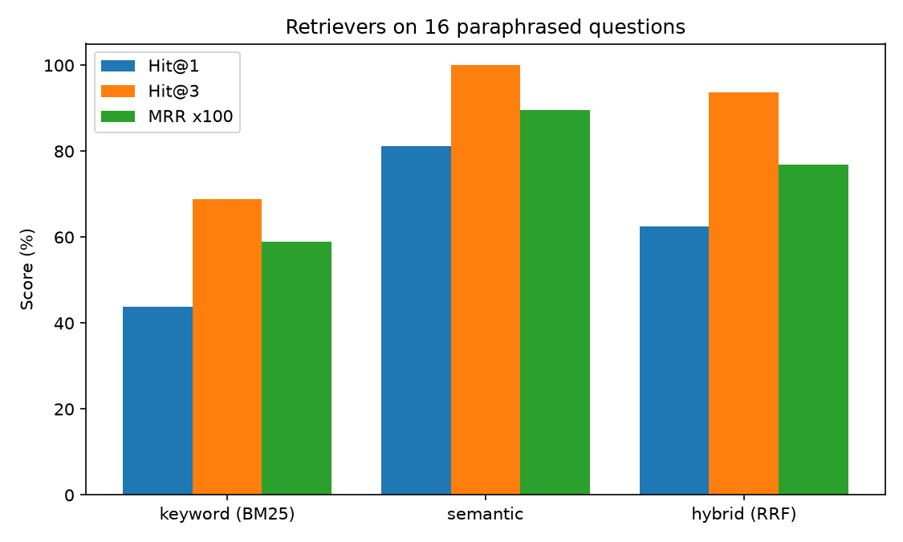

# 📘 Module 06 — Evaluation & LLM-as-Judge

**Generative AI Track • Intermediate**

*"It seems to work"* is not a result. Every change you make to a GenAI system (a new prompt, a different chunk size, a bigger model) might help, might hurt, or might do nothing, and you cannot tell by reading a few outputs.

**Evaluation** is how you find out. It is also the topic that most clearly separates people who *use* LLMs from people who can *improve* them, so interviewers ask about it a lot.

> **New to this?** Evaluation means writing down what "good" looks like as test cases, running your system on them, and getting a number. Then you can change something and see whether the number moves.

---

## 🎯 Objective

In this module, you'll:

- Build a **golden set** of questions with known-correct answers
- Measure retrieval with **Hit@k** and **MRR**
- Compare keyword, semantic, and hybrid retrieval head to head
- Ask **"is this difference real, or noise?"** using a bootstrap confidence interval
- Score answers with string match, token F1, and an **LLM judge**
- **Test the judge against human labels** before trusting it, and check it for bias

---

## 📂 Project Files

| File | Description |
|------|-------------|
| `evaluation.py` | Every experiment in this module. |
| `evaluation.ipynb` | Interactive notebook version, generated from the script. |
| `assets/retrievers.png` | Bar chart comparing the three retrievers. |
| `README.md` | Concepts, real results, and interview Q&A. |

---

## ⚙️ Setup

```powershell
# From repository root
venv\Scripts\activate

cd generative-ai\02-intermediate\06-evaluation

pip install "transformers>=4.56" torch matplotlib
```

## ▶️ Run

```powershell
python evaluation.py
```

Runs in about a minute on a laptop CPU. No API key needed.

---

## 🧠 Key Concepts

### 1. Evaluate Retrieval and Generation Separately

In Module 05, when RAG got an answer wrong, there were two possible causes: retrieval or generation. Each needs its own measurement:

| Part | Question it answers | How to measure |
|---|---|---|
| **Retrieval** | Did the right chunk come back? | Hit@k, MRR (no LLM needed) |
| **Generation** | Given the right chunk, was the answer good? | String match, F1, LLM judge, humans |

---

### 2. The Golden Set

A set of questions paired with what a correct answer must contain. We use 16 questions about the Module 05 handbook, but this time phrased the way a real employee would ask, not copied from the handbook's wording, since that is where retrieval gets hard:

| Handbook says | Employee asks |
|---|---|
| "20 days of paid vacation" | "What's the time-off allowance for someone who just joined?" |
| "up to $180 per night" | "What's the nightly cap on accommodation when I travel?" |
| "USB storage drives are not permitted" | "Is plugging in a flash drive allowed?" |

---

### 3. Retrieval Metrics

| Metric | Meaning |
|---|---|
| **Hit@k** | Share of questions where a relevant chunk is in the top k results |
| **MRR** (mean reciprocal rank) | Average of `1 / rank` of the first relevant chunk. Rewards ranking it *higher*. |

Hit@k asks *"was it found?"*. MRR asks *"how near the top?"*.

We compared three retrievers on the same 16 questions:

- **Keyword (BM25):** ranks by shared words, weighting rare words more (written from scratch in the script)
- **Semantic:** embeddings and cosine similarity (Module 04)
- **Hybrid:** merges both rankings with reciprocal rank fusion

| Retriever | Hit@1 | Hit@3 | MRR |
|---|---|---|---|
| Keyword (BM25) | 44% | 69% | 0.59 |
| **Semantic** | **81%** | **100%** | **0.90** |
| Hybrid (RRF) | 62% | 94% | 0.77 |



Keyword search struggled because employees don't use the handbook's words. For *"time-off allowance for someone who just joined"* the right chunk ranked **13th** of 13, since it shares no useful words with "20 days of paid vacation".

**Surprise: hybrid did worse than semantic.** Hybrid search is often recommended, and it often helps when questions contain exact identifiers, error codes, or rare terms. Here the questions are paraphrases with almost no shared words, so the keyword half mostly adds noise and drags the fused ranking down. We didn't test a question set full of exact identifiers, so we can't say hybrid would win there, but it is the usual reason to reach for it.

---

### 4. Is the Difference Real, or Noise?

With 16 questions, one flipped question moves a score by 6 points. Before claiming "A beats B", check that the gap isn't luck. A **paired bootstrap** re-draws the 16 questions with replacement thousands of times and sees how much the gap moves:

| Comparison (Hit@1) | Gap | 95% interval | Verdict |
|---|---|---|---|
| Semantic minus keyword | +38% | [+6%, +69%] | **Clear difference** |
| Hybrid minus semantic | -19% | [-44%, +6%] | Could be noise |
| Hybrid minus keyword | +19% | [+0%, +38%] | Could be noise |

Semantic really is better than keyword here: the whole interval is above zero. But the interval for "hybrid is worse than semantic" runs from -44% to +6%, which includes zero. **We should not claim hybrid is worse**, only that it wasn't better. This habit prevents chasing differences that aren't there.

---

### 5. Evaluating Answers

Retrieval has one right chunk. Answers are free text, and the same correct answer can be worded many ways. We wrote 16 candidate answers and labeled each **by hand** as correct or wrong. Half are correct but phrased differently from the reference ("Twenty days" instead of "20 days"), and half are plausible but wrong ("10 days").

Then we asked: how often does each automatic scorer **agree with the human**?

| Scorer | Agrees with human | Correct answers wrongly marked wrong |
|---|---|---|
| Exact string match | 56% | 7 |
| Token F1 (word overlap ≥ 0.5) | 62% | 5 |
| LLM judge (0.5B model, threshold 0.5) | 62% | not counted |

String match punishes paraphrase. That is its main weakness, and the reason teams reach for an **LLM judge**.

---

### 6. LLM-as-Judge: Test the Judge

An LLM judge is a model asked to grade another answer. It understands paraphrase, but it is just another model. It can be biased, inconsistent, or wrong, so **you measure its agreement with human labels, like any other component.**

We read the judge's probability of "Yes" (to "does the candidate give the same fact as the reference?"):

| Result | Value |
|---|---|
| Average P(Yes) on correct answers | 0.81 |
| Average P(Yes) on wrong answers | 0.62 |
| **AUC** (chance a correct answer scores above a wrong one) | **0.84** |

The judge's scores do separate good from bad (AUC 0.84, where 0.5 is a coin flip), but weakly: it is quite willing to say "Yes" to wrong answers such as *"the minimum is 8 characters"* (0.80). With the best possible threshold it would reach 81% agreement, but that figure is **optimistic**, because we chose the threshold using the same labels we then scored. On fresh data expect less.

**Testing for verbosity bias.** We took the 8 wrong answers and padded each with confident-sounding filler ("To elaborate, this reflects the standard policy that applies across the whole company..."):

| | Average P(Yes) on wrong answers |
|---|---|
| As written | 0.62 |
| With filler | **0.74** |

Padding raised the judge's approval and **flipped its verdict on 3 of 8 wrong answers**. A judge that rewards length and confident tone will quietly reward exactly the wrong behavior.

**Important limit:** this is a 0.5B-parameter judge on 16 examples. A much larger judge would be far better. The point is the **method** (label some examples, measure agreement, test for bias), which you should apply to whichever judge you use.

---

### 7. Which Evaluation Should You Use?

| Method | Good for | Weakness |
|---|---|---|
| Exact or string match | Short factual answers, IDs, numbers | Fails on paraphrase |
| Token F1 / ROUGE | Cheap overlap check | Rewards words, not meaning |
| Retrieval metrics (Hit@k, MRR) | Retrieval quality, no LLM needed | Needs relevance labels |
| LLM judge | Open-ended answers, tone, groundedness | Biased, must be validated |
| Human review | Ground truth | Slow and costly, so use it to check the others |

---

## 🎤 Interview Q&A

Try answering each question out loud before opening the answer.

<details>
<summary><b>Q1. How would you evaluate a RAG system?</b></summary>

**Short answer:** Build a golden set, then measure retrieval and generation separately: retrieval with Hit@k, recall@k, and MRR, and generation with correctness and groundedness scores.

**Deeper answer:** Retrieval metrics need only relevance labels (which chunk holds the answer), no LLM. Generation is judged on correctness against a reference, **faithfulness** (is every claim supported by the retrieved text?), and relevance. Measuring separately tells you whether to fix retrieval (chunking, embeddings, reranking) or generation (prompt, model). Add cost and latency, and include questions with **no answer** in the corpus to test refusals.

**Follow-ups to expect:**
- What is faithfulness vs correctness? *Faithfulness checks the answer against the retrieved context. Correctness checks it against the truth. An answer can be faithful to a wrong document.*
- Which tools exist? *RAGAS, TruLens, and DeepEval offer ready-made metrics, but the ideas are the ones in this module.*

</details>

<details>
<summary><b>Q2. Explain Hit@k, recall@k, MRR, and nDCG. When do you use each?</b></summary>

**Short answer:** Hit@k: is any relevant item in the top k? Recall@k: what fraction of *all* relevant items are in the top k? MRR: average of `1/rank` of the first relevant item. nDCG: rewards ranking relevant items higher, with graded relevance.

**Deeper answer:** Use Hit@k when one chunk is enough to answer (typical factual QA). Use recall@k when the answer needs several chunks. Use MRR when the position of the first good result matters, such as a UI showing one top result. Use nDCG when relevance has degrees (highly relevant vs somewhat) and the whole ranking matters. Retrieval for RAG usually cares most about recall@k, since the LLM can ignore extra chunks but cannot use a missing one.

**Follow-ups to expect:**
- Why can a higher `k` raise recall but hurt answers? *More context means more noise and more tokens for the model to sift through.*

</details>

<details>
<summary><b>Q3. What is LLM-as-a-judge, and what are its pitfalls?</b></summary>

**Short answer:** Using an LLM to grade another model's output against a rubric or reference. It scales to open-ended answers, but it has biases and must be validated against humans.

**Deeper answer:** Known problems: **position bias** (preferring the first or last option), **verbosity bias** (preferring longer answers; we saw padding flip 3 of 8 wrong-answer verdicts), **self-preference** (favoring its own model family's style), and inconsistency between runs. Mitigations: give a precise rubric, judge with a strong model from a different family, randomize option order and average, use reference answers, and above all **measure agreement with a human-labeled sample** and re-check when the judge model or prompt changes.

**Follow-ups to expect:**
- How many human labels do you need? *Enough that the agreement number is stable. A few dozen well-chosen examples is a start, more for a decision that matters.*
- Pairwise vs absolute scoring? *Pairwise comparisons are usually more reliable than absolute 1 to 10 scores, but need order randomization.*

</details>

<details>
<summary><b>Q4. Your new prompt scores 3 points higher on your eval set. How do you know it's better?</b></summary>

**Short answer:** You don't yet. Check whether the difference is bigger than the noise, using a paired bootstrap or a significance test, and look at the size of the test set.

**Deeper answer:** With small sets, a few flipped examples swing the score. Compare the two versions on the *same* questions (paired), resample to get a confidence interval on the difference, and only trust gaps whose interval excludes zero. In our retriever test, semantic beat keyword by 38 points with an interval of [+6, +69], a real difference, while hybrid vs semantic (-19, interval [-44, +6]) could not be distinguished from zero. Also look at *which* questions changed, watch for regressions in other areas, and consider variance from sampling if you don't use greedy decoding.

**Follow-ups to expect:**
- How do you get a bigger eval set cheaply? *Log real user questions, and add synthetic ones generated by an LLM then reviewed by a human.*

</details>

<details>
<summary><b>Q5. How do you build a good golden set?</b></summary>

**Short answer:** Start from real user questions, cover the range of intents and difficulty, include edge cases and unanswerable questions, and have a human verify the expected answers.

**Deeper answer:** Sources: production logs (best), subject-matter experts, and synthetic questions generated from your documents (fast, but review them because they tend to copy the document's wording and be too easy). Write questions the way users phrase them, not the way documents do, as we did here. Include multi-chunk questions, ambiguous ones, and questions with **no answer**. Keep a held-out portion you never tune against, or you will overfit to the eval set. Version it and grow it every time a bug is found.

**Follow-ups to expect:**
- Why are synthetic questions risky? *They share vocabulary with the source passage, so keyword and embedding search look better than they will on real users.*

</details>

<details>
<summary><b>Q6. What is the difference between offline and online evaluation?</b></summary>

**Short answer:** Offline evaluation runs a fixed test set before release. Online evaluation measures real usage after release, through user feedback, A/B tests, and monitoring.

**Deeper answer:** Offline evals are repeatable and fast, so use them to gate every change (like unit tests). But they only cover what you thought to test. Online signals (thumbs up/down, follow-up rates, escalations, task completion, latency, cost) show what actually matters to users and reveal new failure types, which then become new offline test cases. Mature teams run both, and treat regressions in the offline set as release blockers.

**Follow-ups to expect:**
- What would you monitor in production? *Answer quality signals, refusal rate, retrieval scores, latency, token cost, and error rates.*

</details>

---

## 🎯 Key Takeaways

After completing this module, you'll understand:

- Why you build a golden set first, and how to phrase its questions like real users
- How Hit@k and MRR measure retrieval without any LLM
- How to check whether a difference between two systems is real or noise
- Why string metrics fail on paraphrase, and what an LLM judge adds
- That an LLM judge must be **validated against humans** and tested for bias
- Why "better on one example" and "better on the test set" are very different claims

---

## 🔗 Go Deeper in the Weekly Curriculum

| Topic | Where |
|---|---|
| Evaluating fine-tuned models | [Week 2, Day 5](../../../weeks/week-02-fine-tuning-fundamentals/day-05-model-evaluation/README.md) |
| RAG systems to evaluate | [Module 05](../05-rag/README.md) |
| Evaluation frameworks and safety | Week 9 — Model Evaluation, Safety & Alignment *(planned)* |

---

## 🚀 What's Next?

**Module 07 • Tool Use & Agents**

So far the model only answers. Next you'll let it **act**: call a calculator, search your documents, and decide what to do next in a loop.
