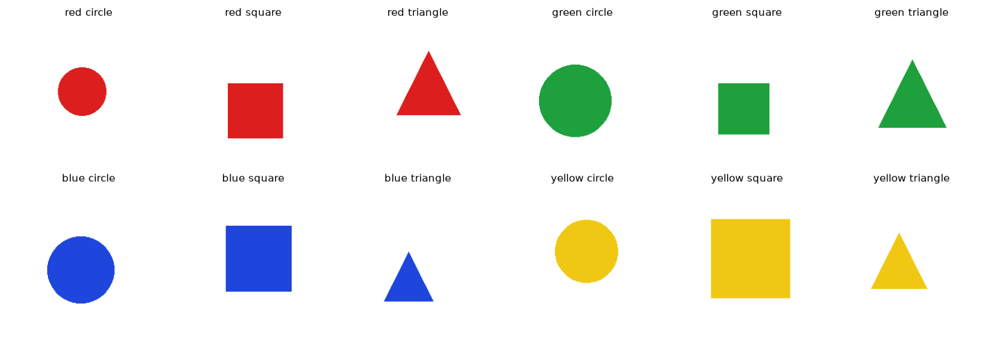
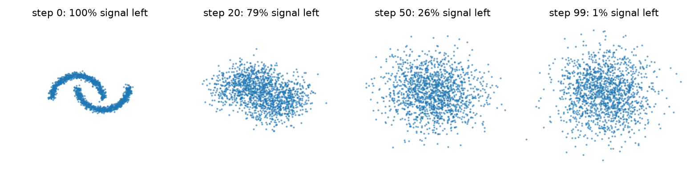
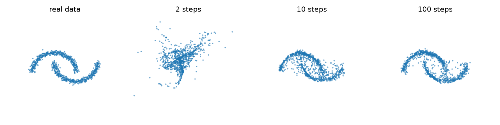

# 📘 Module 10 — Multimodal & Diffusion Models

**Generative AI Track • Intermediate**

Everything so far was text. This module leaves text behind to see how models **understand images** (multimodal models) and how they **generate images** (diffusion models), with a real experiment for each.

> **New to this?** A *multimodal* model handles more than one kind of data, such as text and images together. A *diffusion* model is the technique behind most modern image generators: it learns to turn random static into a picture, one small cleanup at a time.

---

## 🎯 Objective

In this module, you'll:

- See that an image is just an **array of numbers**
- Use **CLIP** to classify images it was never trained on, by comparing them with text
- **Hunt for CLIP's weaknesses** with counting and left-versus-right tests
- Build a **diffusion model from scratch** and watch it learn to denoise
- Measure the **quality versus speed** trade-off of diffusion sampling
- Understand how this toy relates to Stable Diffusion

---

## 📂 Project Files

| File | Description |
|------|-------------|
| `multimodal_diffusion.py` | Both parts: the CLIP experiments and the from-scratch diffusion model. |
| `multimodal_diffusion.ipynb` | Interactive notebook version, generated from the script. |
| `assets/sample_shapes.png` | The images we drew for the CLIP tests. |
| `assets/forward_noising.png` | Data being destroyed by noise, step by step. |
| `assets/diffusion_samples.png` | Samples generated with 2, 10, and 100 steps. |
| `README.md` | Concepts, real results, and interview Q&A. |

---

## ⚙️ Setup

```powershell
# From repository root
venv\Scripts\activate

cd generative-ai\02-intermediate\10-multimodal-diffusion

pip install "transformers>=4.56" torch matplotlib scikit-learn pillow
```

## ▶️ Run

```powershell
python multimodal_diffusion.py
```

The first run downloads CLIP (`openai/clip-vit-base-patch32`, roughly 600 MB). Everything runs on a laptop CPU (no GPU needed). No API key needed.

---

## 🧠 Key Concepts

## Part A — Understanding images with CLIP

### 1. Images Are Numbers

A 224×224 color image is an array of shape `(224, 224, 3)`: a red, green, and blue value from 0 to 255 for every pixel. We draw shapes ourselves, so we always know the right answer.



### 2. CLIP: One Space for Images and Text

**CLIP** was trained on hundreds of millions of image and caption pairs so that a picture and its description land **close together** in one embedding space. This is Module 04's idea applied across two media.

That enables **zero-shot classification**: to classify an image, write each candidate label as a sentence ("a red circle") and pick the sentence whose embedding is closest to the image's. No training on our shapes is needed.

We drew 60 images (4 colors × 3 shapes × 5 each) and asked CLIP to choose among 12 descriptions:

| | Accuracy | Chance |
|---|---|---|
| Color correct | **100%** | 25% |
| Shape correct | **92%** | 33% |
| Color **and** shape | **92%** | 8% |

CLIP never saw these particular drawings and was never trained to name shapes, yet it does well. That is the value of a shared embedding space.

### 3. Where Does It Break?

A model that does well on the easy test tells you little. Good evaluation hunts for **weaknesses**, so we tried two things humans find trivial:

| Test | Accuracy | Chance |
|---|---|---|
| Name the color and shape | **92%** | 8% |
| Count circles (1, 2, or 3) | **54%** | 33% |
| Left vs right (red circle / blue square) | **50%** | 50% |

The model that names colors and shapes nearly perfectly is **much worse at counting** and **exactly at chance on left versus right**. Each of those two tests has only 24 images, so treat the exact percentages as approximate. The pattern matches a well-known limitation of this style of model: its embedding seems to capture *what is in the picture* far better than *how it is arranged* (we did not test why).

This matters when you build on top of it. A product that needs "the red car on the left" will misbehave. The general lesson: **test the abilities your application depends on**, not just the ones the model is famous for.

---

## Part B — Generating images with diffusion

### 4. The Idea

A **diffusion model** generates by **removing noise**. Training has two halves:

1. **Forward process (fixed, no learning):** take real data and add a little noise, again and again, until only static remains.
2. **Reverse process (learned):** train a network to **predict the noise** that was added. To generate, start from pure static and repeatedly subtract the predicted noise.

We do this on 2D points shaped like two crescent moons. The math is the same as for images, but we can *see* and *measure* every step.

**The forward process destroys the data:**



By step 99 only about 1% of the original signal remains: a fuzzy blob of noise.

### 5. Training: Predict the Noise

The network sees a noisy point and the step number, and predicts the noise that was mixed in. The loss is the squared error between predicted and true noise. It fell from about 1.04 (no better than guessing) to 0.27 over 4,000 training steps.

### 6. Sampling, and Quality vs Speed

To generate, start from pure noise and step backward. **DDIM** sampling lets us take **fewer, bigger steps** by skipping some, which is how real image models run in a handful of steps instead of hundreds.

We score quality with **MMD** (maximum mean discrepancy): it is near **0** when two sets of points come from the same distribution and grows as they differ.

| Sampler | MMD (lower is better) |
|---|---|
| Real data vs fresh real data (the floor) | 0.0001 |
| A plain Gaussian blob (a lazy baseline) | 0.0294 |
| Diffusion, **2 steps** | 0.1562 |
| Diffusion, **5 steps** | 0.0708 |
| Diffusion, **10 steps** | 0.0219 |
| Diffusion, **25 steps** | 0.0123 |
| Diffusion, **100 steps** | 0.0124 |



What the numbers say:

- **2 and 5 steps were worse than a lazy Gaussian blob.** The samples are smeared, because the model is asked to jump from static to data in one or two giant leaps.
- **Quality improved sharply up to about 25 steps, then flattened.** 25 steps and 100 steps scored the same, so the last 75 steps bought nothing measurable.
- **Even 100 steps stayed far above the floor.** Our tiny network is not perfect, and that gap is model quality, which sampling steps cannot fix.

This is the trade-off real image models face: **more denoising steps give better images and take longer, with diminishing returns.** That is why so much research goes into faster sampling (fewer steps, better samplers, distilled models).

### 7. From This Toy to Stable Diffusion

| Toy model here | Real text-to-image model |
|---|---|
| 2D points | Images, compressed to a smaller **latent** space by a VAE (Module 01) |
| Small MLP predicts the noise | Large **U-Net** or Transformer predicts the noise |
| Step number as input | Step number **and the text prompt** as input |
| 100 steps | Typically tens of steps, sometimes fewer |

**How text steers the image:** a text encoder (a CLIP-style model like the one in Part A) turns your prompt into embeddings that are fed to the noise predictor at every step, so the noise it removes is noise that moves the picture toward the description. **Classifier-free guidance** runs the model twice, with and without the prompt, and pushes the result further toward the prompted version.

> **What we did not run:** a full Stable Diffusion model needs a multi-gigabyte download and a GPU to be practical, so we did not run one here. On a GPU (for example on Colab) the `diffusers` library runs one in a few lines. The snippet in the notebook is shown for reference and was **not executed**.

---

## 🎤 Interview Q&A

Try answering each question out loud before opening the answer.

<details>
<summary><b>Q1. How does a diffusion model generate an image?</b></summary>

**Short answer:** It starts from pure random noise and repeatedly removes noise, using a network trained to predict the noise in a partly noisy image, until a clean image emerges.

**Deeper answer:** Training uses a fixed forward process that gradually adds noise to real images until only static remains. A network learns to predict the noise that was added at each step, given the noisy image and the step number. Generation runs this in reverse: start with static, predict the noise, subtract some of it, and repeat. In our toy example the same recipe turned static into two crescent moons.

**Follow-ups to expect:**
- What is the loss? *Usually the mean squared error between the predicted noise and the true noise.*
- Why predict noise instead of the image directly? *It is an easier and more stable learning target, and it works well in practice.*

</details>

<details>
<summary><b>Q2. Why is diffusion slow at generation, and how is it sped up?</b></summary>

**Short answer:** Each image needs many sequential network passes, one per denoising step. It is sped up with fewer-step samplers, distillation, and working in a compressed latent space.

**Deeper answer:** We measured it: with 2 steps the samples were badly smeared (MMD 0.156), quality improved sharply to about 25 steps (0.012), and then flattened, since 100 steps scored the same. Speed-up techniques include better samplers such as DDIM that skip steps, **distillation** that trains a model to do in a few steps what the original does in many, and **latent diffusion** that runs the process on a much smaller compressed representation instead of full-size pixels.

**Follow-ups to expect:**
- Why are GANs faster at sampling but less used now? *A GAN generates in one pass, but diffusion trains more stably and covers the data better (Module 01).*

</details>

<details>
<summary><b>Q3. What is CLIP, and what is zero-shot classification?</b></summary>

**Short answer:** CLIP embeds images and text in one shared space, trained so that a picture and its caption are close. Zero-shot classification means classifying into categories it was never trained on by comparing the image with text descriptions of each category.

**Deeper answer:** You write each label as a sentence, embed them all, embed the image, and pick the closest sentence. No labeled examples for your categories are needed. We got 92% on 12-way shape-and-color classification of drawings CLIP had never seen. Prompt wording matters ("a photo of a red circle" can differ from "red circle"), so test a few phrasings.

**Follow-ups to expect:**
- Where else is CLIP used? *As the text encoder that steers image generators, and for image search by text.*

</details>

<details>
<summary><b>Q4. What are the known weaknesses of multimodal models, and how would you test for them?</b></summary>

**Short answer:** Counting, spatial relations (left of, above), reading small or dense text, fine detail, and negation are common weak spots. Test them directly with targeted examples.

**Deeper answer:** We built synthetic images with known answers. CLIP got color and shape right 92% of the time, but only 54% on counting circles (chance 33%) and exactly 50% on left versus right (chance 50%), on 24 images per test. The method matters more than the numbers: create a small set of cases where you know the answer, cover the abilities your application actually needs, and compare with chance so you can see when a model is guessing.

**Follow-ups to expect:**
- How would you mitigate a weakness? *Add tools (an object detector for counting), constrain the task, use a stronger model, or add a human check.*

</details>

<details>
<summary><b>Q5. How does a text prompt control the image in a text-to-image model?</b></summary>

**Short answer:** The prompt is turned into embeddings by a text encoder and fed into the denoising network at every step, so each step removes noise in a direction that matches the description. Classifier-free guidance strengthens this.

**Deeper answer:** Without the prompt the model generates something plausible but random. With it, the network's noise prediction depends on the text embedding. Classifier-free guidance computes the prediction both with and without the prompt and extrapolates away from the unprompted version, trading diversity for prompt fidelity through a *guidance scale*: too low ignores the prompt, too high looks over-processed.

**Follow-ups to expect:**
- What is a latent diffusion model? *One that runs the diffusion process in a compressed latent space produced by a VAE, which is far cheaper than working on full-resolution pixels.*

</details>

<details>
<summary><b>Q6. How do you evaluate a generative image model?</b></summary>

**Short answer:** Use automatic metrics for distribution quality (such as FID), automatic checks for prompt alignment (such as CLIP score), and human evaluation for what matters to users.

**Deeper answer:** Metrics compare the *distribution* of generated images with real ones (FID) or measure how well an image matches its prompt using a model like CLIP. Both are imperfect: a metric can be fooled, and CLIP itself is weak at counting and layout, so a CLIP-based alignment score can miss exactly those errors. Our toy used MMD, a similar distribution distance, and it separated a good sampler (0.012) from a bad one (0.156) clearly. For real products, add human preference tests and safety checks.

**Follow-ups to expect:**
- Why not rely on one number? *Different metrics catch different failures, and a model can score well while still failing your specific use case.*

</details>

---

## 🎯 Key Takeaways

After completing this module, you'll understand:

- That an image is an array of numbers, and how CLIP puts images and text in one embedding space
- How zero-shot classification works, and how well it did (92%) on shapes it never saw
- That strong multimodal models can still fail at counting and spatial layout, and how to test for it
- How diffusion learns to remove noise, and how to generate by reversing the noising process
- The quality versus speed trade-off in sampling, with diminishing returns
- How text prompts steer image generation

---

## 🔗 Go Deeper

| Topic | Where |
|---|---|
| Generative model families, including GANs and VAEs | [Module 01](../../01-beginner/01-genai-landscape/README.md) |
| Embeddings and similarity | [Module 04](../../01-beginner/04-embeddings-vector-search/README.md) |
| Evaluating models and finding weaknesses | [Module 06](../06-evaluation/README.md) |

---

## 🚀 What's Next?

**Module 11 • Deployment & LLMOps**

The last module: how to serve a model to real users, and how to measure latency, batching, caching, quantization, and cost.
