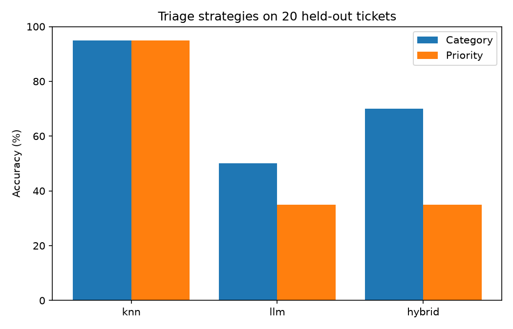

# 🎫 Beginner Project — Support Ticket Assistant

**Generative AI Track • Beginner Project** (uses Modules 02, 03, and 04)

A command-line tool that helps a support team by **triaging** incoming tickets (category and priority), **finding similar past tickets** with their resolutions, and **drafting a reply** grounded in those resolutions.

It runs entirely on your laptop CPU with two small open models. No API key needed.

The interesting part is not the tool. It is that the project **measures three different ways of doing the same job**, and the simplest one wins by a wide margin.

---

## 🎯 What You'll Practice

| Skill | From |
|---|---|
| Prompting a chat model for structured JSON, with validation and a correcting retry | Module 02 |
| Testing approaches on held-out data instead of guessing | Module 02 |
| Being careful with what goes into the model and how many calls you make | Module 03 |
| Semantic search, similarity scores, and thresholds | Module 04 |
| Combining retrieval with prompting, and knowing when *not* to use an LLM | This project |

---

## 📂 Project Structure

```text
01-support-ticket-assistant/
├── main.py                  # command-line interface
├── assistant/
│   ├── models.py            # loads the embedding model and the chat model
│   ├── knowledge.py         # TicketIndex: past tickets searchable by meaning
│   ├── triage.py            # the three triage strategies
│   ├── reply.py             # grounded reply drafting with safeguards
│   └── evaluate.py          # compares strategies on held-out tickets
├── data/
│   ├── past_tickets.jsonl   # 48 past tickets with category, priority, resolution
│   └── eval_tickets.jsonl   # 20 held-out tickets, never used as examples
├── tests/test_assistant.py  # 16 unit tests, no models needed
├── results/evaluation.json  # measured results
└── assets/strategy_comparison.png
```

All ticket data is fictional and written for this project.

---

## ⚙️ Setup

```powershell
# From repository root
venv\Scripts\activate

cd generative-ai\projects\01-support-ticket-assistant

pip install "transformers>=4.56" torch matplotlib
```

The first run downloads two small models: `all-MiniLM-L6-v2` (about 90 MB) for embeddings and `Qwen2.5-0.5B-Instruct` (about 1 GB) for chat.

---

## ▶️ Usage

```powershell
# Triage a ticket and show similar past tickets
python main.py triage "My card was charged two times for the same month"

# ...and draft a reply
python main.py triage "My card was charged two times for the same month" --draft

# Just find similar past tickets
python main.py similar "I forgot my login credentials"

# Compare all three strategies on the held-out tickets
python main.py evaluate

# Run the unit tests (no models needed)
python -m unittest discover -s tests -v
```

Example output:

```text
Ticket:   My card was charged two times for the same month, please fix this
Category: billing
Priority: high
Strategy: knn

Similar past tickets:
  [0.64] (billing/high) I was charged twice for my monthly subscription.
         Resolution: The duplicate charge was reversed and the refund arrives in 5 to 7 business days.
  [0.50] (billing/medium) My card was declined but the payment shows as pending.
  [0.49] (billing/high) I cancelled my subscription but was billed again.

Draft reply (source: template):
Thanks for reaching out. The duplicate charge was reversed and the refund arrives in 5 to 7 business days.
```

---

## 🧪 The Experiment: Three Ways to Triage

| Strategy | How it works |
|---|---|
| **knn** | Embed the ticket, find the 5 most similar past tickets, and take a similarity-weighted vote for category and priority. No LLM. |
| **llm** | Prompt the chat model with 4 fixed examples and ask for JSON. Validate, and retry once with a correction. |
| **hybrid** | Same prompt, but the examples are the 4 most similar past tickets. Falls back to knn if the JSON is unusable. |

Results on 20 held-out tickets:

| Strategy | Category | Priority | Time |
|---|---|---|---|
| **knn** | **95%** | **95%** | 0.1 s |
| llm | 50% | 35% | 33 s |
| hybrid | 70% | 35% | 31 s |



### What the numbers say

- **The simplest approach won.** Embedding search plus a vote beat the language model on both fields, and was about 300 times faster. Not every problem needs a generative model. When you have labeled examples and a fixed set of labels, retrieval-based classification is a strong baseline that should be beaten before you reach for an LLM.
- **Retrieval helped the LLM.** Showing the model similar past tickets (hybrid) lifted category accuracy from 50% to 70%. Choosing examples by relevance beats a fixed set.
- **Priority is hard for the small model.** Priority depends on context (a security issue is urgent, a feature request is not), and the 0.5B model got it right only 35% of the time.
- **The knn fallback was never needed.** With concrete examples in the prompt, the model's JSON was always usable within two attempts. (We count fallbacks, not retries, so we cannot say how often the retry fired.) The fallback is there because it *could* happen.

### Read these numbers with care

- **20 tickets is small.** Each ticket is worth 5 points, so the gaps between strategies are meaningful but the exact percentages are not precise.
- **The test favors retrieval.** The held-out tickets were written as paraphrases of the same kinds of issues that appear in the past tickets, which is what a real support queue looks like, but it is friendlier to nearest-neighbor methods than truly novel problems would be.
- **The chat model is tiny.** A larger model would score much higher on the LLM strategies, and might beat knn. The lesson is the method (measure, compare, pick the cheapest that works), not that LLMs are bad at this.
- **Results are deterministic.** Decoding is greedy, so re-running gives the same numbers.

The only knn mistake was *"Please allow login through our company Okta."* It was labeled `feedback` (a feature request) but the word "login" pulled it toward `account`.

---

## ✍️ Drafting Replies Safely

Asking a small model to write a reply from scratch went badly in testing: it ignored the resolution and asked for more details, refused ("I'm sorry, but I can't assist with that"), and once invented a "NASA website" reference. So the reply step has safeguards:

1. **Similarity threshold.** If no past ticket scores at least 0.35, the ticket is escalated to a human. *"how do I bake a chocolate cake"* matched at 0.15 and was escalated.
2. **Narrow task.** The model only restates **one** known resolution politely. It does not compose freely.
3. **Grounding checks.** The draft must reuse the resolution's key words *and* add almost nothing of its own. Otherwise a plain template is used: *"Thanks for reaching out. {resolution}"*.

In our demo tickets, **every draft failed the checks and fell back to the template**. The 0.5B model could not restate a resolution faithfully, so the safeguards did exactly their job, and the reply the customer sees is always grounded in a real resolution. With a stronger model you would expect more drafts to pass.

### Known limitations

- **Similarity measures topic, not correctness.** *"The moon landing was faked and I want a refund on the moon"* matched a refund ticket at 0.53, and *"my order for a new phone never arrived"* matched the verification-email ticket at 0.39, both above the threshold. The thresholds catch off-topic questions, not topic-adjacent nonsense. This is the weakness from Module 04.
- **Word-overlap checks are heuristics.** They catch obvious drift but cannot verify that a resolution actually answers the question.
- **Always treat the output as a draft** for a human to review before sending.

---

## 🎤 How to Talk About This Project in an Interview

**The 30-second pitch:**
> "I built a support ticket assistant that triages tickets, finds similar past tickets, and drafts grounded replies, all on local models. I compared three triage approaches on held-out data and found that embedding-based nearest neighbors, with no LLM, scored 95% versus 50% for a small LLM and was 300x faster. So I used retrieval as the core and kept the LLM only where it added something, with guardrails around it."

**Questions this project prepares you for:**

| They ask | You can say |
|---|---|
| "How did you decide between an LLM and a simpler approach?" | I measured. Three strategies, same held-out set, accuracy and latency side by side. |
| "How do you get reliable structured output?" | Concrete examples in the prompt, JSON parsing, validation against allowed values, a retry that adds a correction (a retry with an identical prompt repeats itself under greedy decoding), and a fallback path. |
| "How do you prevent hallucination?" | Narrow the model's task, ground it in a retrieved resolution, check the output against that source, and fall back to a template. |
| "How did you evaluate it?" | A held-out set that was never used as examples, plus unit tests for the parsing, voting, and safeguard logic. |
| "What would you do next?" | A larger labeled set, a stronger model, a reranker, hybrid keyword and semantic search, and logging real tickets to grow the evaluation set. |
| "What are its weaknesses?" | The similarity threshold catches off-topic input but not topic-adjacent nonsense, and word-overlap grounding is only a heuristic. |

---

## 🚀 Extend It

- Add a larger evaluation set and report accuracy per category
- Swap in a hosted model (Module 03) for the `llm` and `hybrid` strategies and re-run `evaluate`
- Add hybrid search: combine keyword matching with embeddings
- Show a confidence score, and route low-confidence tickets to a human
- Persist the index with Chroma (Module 04) instead of rebuilding it each run

---

## 🚀 What's Next?

**Intermediate Track • Module 05 — Retrieval-Augmented Generation (RAG)**

This project already contains the seed of RAG: retrieve relevant text, then ground a model's answer in it. Module 05 does it properly, with document chunking, citations, and a way to measure retrieval quality.
